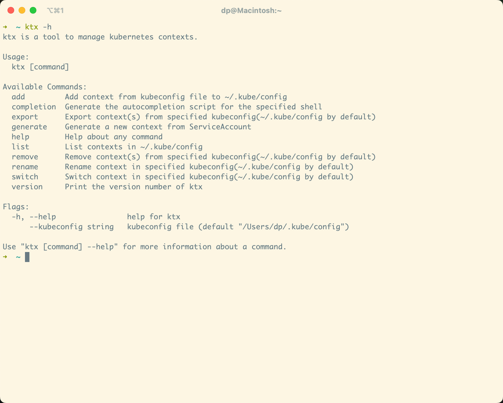

# ktx

English | [简体中文](README_zh-CN.md)

ktx is an easy-to-use command line tool for kubernetes multi-cluster context management.


## Installation

- Install with `go install`

```bash
go install -u github.com/ketches/ktx@latest
```

- Install from binary

For MacOS or Linux:

```bash
curl -sSL https://github.com/ketches/ktx/raw/master/install.sh | sh
```

For Windows:

Download the lastest executable from [Releases](https://github.com/ketches/ktx/releases/latest) and add it to the PATH.

## Usage



1. Add cluster context

```bash
ktx add -f .kube/kind-cluster-01
ktx add -f .kube/kind-cluster-02
```

2. List cluster contexts

```bash
ktx list
```

Alias: `ktx ls`

3. Switch cluster context

```bash
# Switch contexts
ktx

# Switch to specified cluster context
ktx switch kind-cluster-01

# Interactive switch
ktx switch
```

Alias: `ktx s`

4. Rename cluster context

```bash
# Rename specified cluster context
ktx rename kind-cluster-01

# Interactive rename
ktx rename
```

5. Remove cluster context

```bash
# Remove specified cluster context
ktx remove kind-cluster-01

# Interactive remove
ktx remove
```

Alias: `ktx rm`

6. Export cluster context

```bash
ktx export kind-cluster-01 -f .kube/export-01
```

7. Generate kubeconfig from ServiceAccount

```bash
ktx generate --service-account default -f .kube/my-gen-config
```

Alias: `ktx gen`

8. Set namespace

```bash
ktx set-namespace --namespace default
```

9. Set Server address

```bash
ktx set-server --server https://api.k8s.local:6443
```
