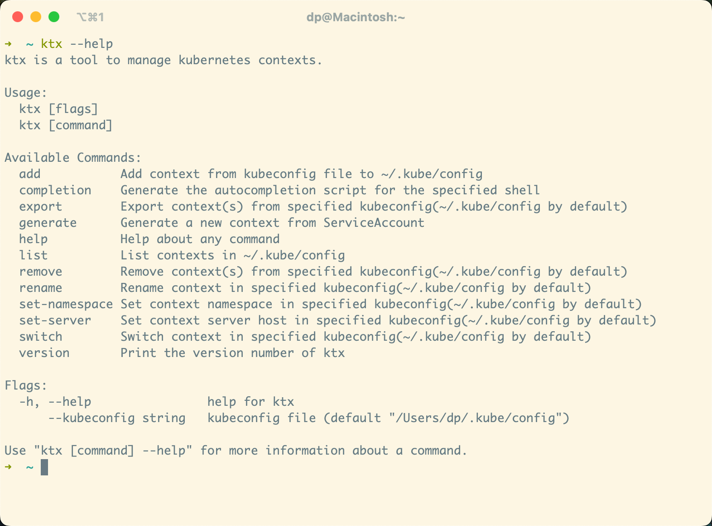

# ktx

[English](README.md) | 简体中文

ktx 是一个针对 Kubernetes 多集群上下文管理的命令行工具，简单易用。


## 安装

- 通过 `go install` 安装

```bash
go install -u github.com/ketches/ktx@latest
```

- 通过二进制文件安装

对于 MacOS 或 Linux：

```bash
curl -sSL https://github.com/ketches/ktx/raw/master/install.sh | sh
```

对于 Windows：

从 [Releases](https://github.com/ketches/ktx/releases/latest) 下载最新版本可执行文件并将其添加到 PATH。

## 使用



1. 添加集群上下文

```bash
ktx add -f .kube/kind-cluster-01
ktx add -f .kube/kind-cluster-02
```

2. 列出集群上下文

```bash
ktx list
```

命令别名：`ktx ls`

3. 切换集群上下文

```bash
# 切换上下文
ktx

# 切换到指定集群上下文
ktx switch kind-cluster-01

# 交互式切换
ktx switch
```

命令别名：`ktx s`

4. 重命名集群上下文

```bash
# 重命名指定集群上下文
ktx rename kind-cluster-01

# 交互式重命名
ktx rename
```

5. 删除集群上下文

```bash
# 删除指定集群上下文
ktx remove kind-cluster-01

# 交互式删除
ktx remove
```

命令别名：`ktx rm`

6. 导出集群上下文

```bash
ktx export kind-cluster-01 -f .kube/export-01
```

7. 从 ServiceAccount 生成 kubeconfig

```bash
ktx generate --service-account default -f .kube/my-gen-config
```

命令别名：`ktx gen`

8. 设置命名空间

```bash
ktx set-namespace --namespace default
```

9. 设置 Server 地址

```bash
ktx set-server --server https://api.k8s.local:6443
```
